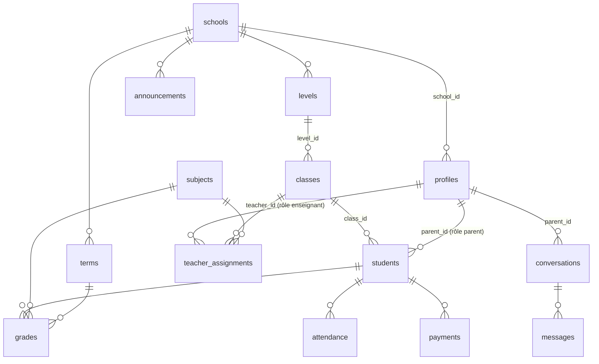

# Schéma de base de données — v1

SaaS de gestion scolaire pour écoles privées marocaines. Base Postgres (Supabase), authentification Supabase Auth, RBAC appliqué par Row Level Security (RLS) directement en base.

**Principes :**

- Toutes les tables portent un `school_id` → multi-écoles prêt, la v1 tourne avec une seule école.
- Les valeurs d'enums sont en anglais technique (`paid`, `absence`…), les libellés affichés sont en français via la couche i18n (structure prête pour l'arabe/RTL).
- Les moyennes (par matière, générale) ne sont **pas stockées** : elles sont calculées à la volée à partir des notes et coefficients — pas de risque de désynchronisation.
- La sécurité ne repose pas sur le front : chaque règle d'accès est une politique RLS en base.

## Diagramme

## Tables

| Table | Rôle | Champs clés |
|---|---|---|
| `schools` | L'école (une seule en v1) | nom, adresse, téléphone, année scolaire |
| `profiles` | Utilisateurs (1-1 avec `auth.users`) | rôle (`admin`/`teacher`/`parent`), nom, prénom, téléphone |
| `levels` | Niveaux (CP, CE1…) | nom, ordre d'affichage, **mensualité par défaut du niveau (MAD)** |
| `classes` | Classes (CE1-A…) | niveau, nom, année scolaire |
| `subjects` | Matières | nom |
| `teacher_assignments` | Affectation enseignant → (classe, matière) | fonde le périmètre RBAC de l'enseignant |
| `students` | Élèves | nom, prénom, classe, **parent lié** (`parent_id`), téléphone, mensualité spécifique (optionnelle, prime sur celle du niveau) |
| `terms` | Trimestres | nom, année scolaire, dates — les bulletins/moyennes sont par trimestre |
| `grades` | Notes | élève, matière, trimestre, intitulé (« Contrôle 1 »), note/20, coefficient, date |
| `attendance` | Absences & retards | élève, classe, date, type (`absence`/`late`), justifié, commentaire — 1 ligne par élève/jour/type |
| `payments` | Mensualités | élève, mois, montant MAD, statut (`unpaid`/`paid`), date de règlement, mode (`cash`/`cheque`/`transfer`), n° de reçu — 1 ligne = 1 mensualité |
| `announcements` | Annonces de la direction | titre, contenu, épinglée, date |
| `conversations` / `messages` | Messagerie parent ↔ direction | fil par parent, messages horodatés avec accusé de lecture |

## Choix de conception (à valider)

1. **Trimestres** : table `terms` ajoutée (3 trimestres/an) — indispensable pour des bulletins crédibles au Maroc. Les moyennes et le bulletin sont calculés par trimestre.
2. **Parent lié** : un seul compte parent par élève (`students.parent_id`), un parent peut avoir plusieurs enfants. Extensible plus tard vers une table de liaison si besoin (deux parents).
3. **Mensualités** : tarif par défaut porté par le **niveau** (`levels.default_monthly_fee`), surchargeable par élève (`students.monthly_fee`). Une ligne `payments` par élève et par mois ; l'encaissement manuel passe la ligne à `paid` avec mode de règlement et n° de reçu (unique par école, format `REC-2025-0001`).
4. **Affectations enseignant** : par couple (classe, matière). Un enseignant saisit des notes uniquement pour ses couples (classe, matière), et les absences pour toute classe où il enseigne.
5. **Comptes** : pas d'auto-inscription. Les comptes enseignants/parents sont créés par l'admin (API route serveur avec la clé service role).

## Matrice RBAC (appliquée par RLS en base)

| Table | Admin | Enseignant | Parent |
|---|---|---|---|
| `schools` | lecture + modification (son école) | lecture | lecture |
| `profiles` | CRUD (son école) | son profil + profils direction | son profil + profils direction |
| `levels` / `classes` / `subjects` / `terms` | CRUD | lecture | lecture |
| `teacher_assignments` | CRUD | lecture (les siennes) | — |
| `students` | CRUD | lecture (ses classes) | lecture (ses enfants) |
| `grades` | CRUD | CRUD sur ses (classe, matière) | lecture (ses enfants) |
| `attendance` | CRUD | CRUD sur ses classes | lecture (ses enfants) |
| `payments` | CRUD | **aucun accès** | lecture (ses enfants) |
| `announcements` | CRUD | lecture | lecture |
| `conversations` / `messages` | tout (son école) | — | ses fils uniquement |

Fonctions utilitaires RLS (`security definer`) : `current_school_id()`, `current_user_role()`, `is_admin()`, `teacher_in_class(class_id)`, `teacher_teaches(class_id, subject_id)`, `is_parent_of(student_id)`.

## Fichiers

- [`supabase/migrations/0001_schema.sql`](../supabase/migrations/0001_schema.sql) — enums, tables, index, trigger messagerie
- [`supabase/migrations/0002_rls.sql`](../supabase/migrations/0002_rls.sql) — fonctions utilitaires + politiques RLS
